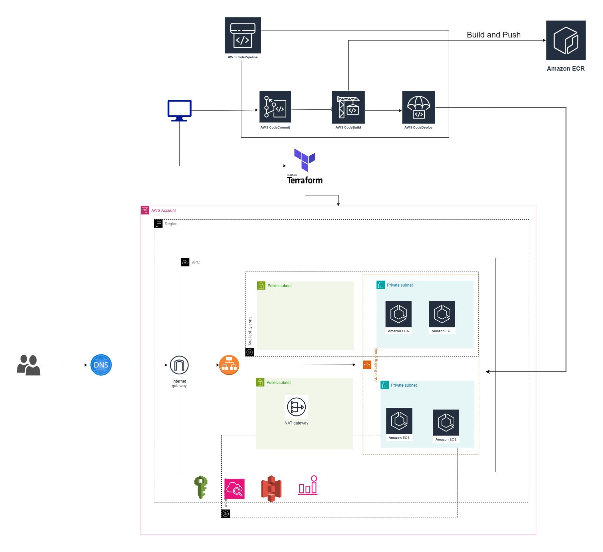
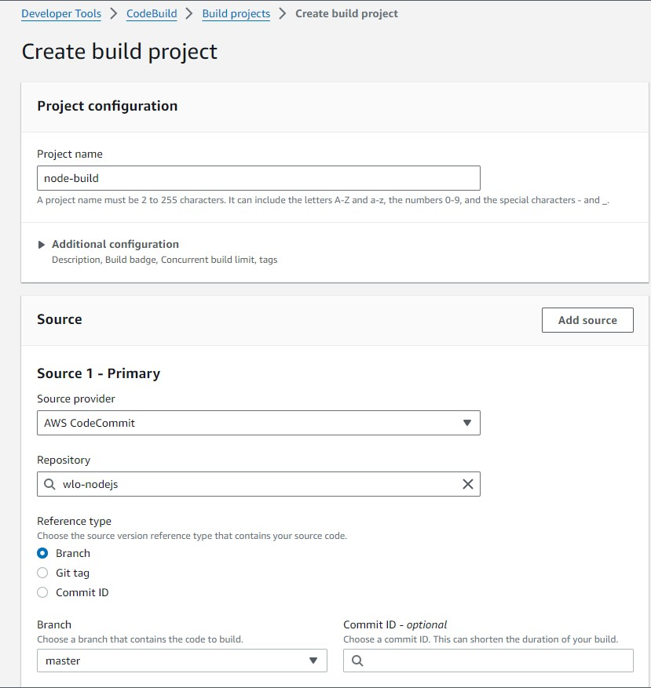
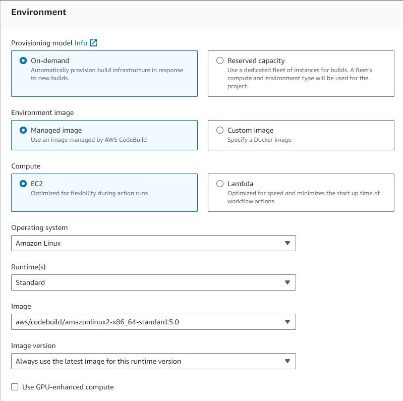
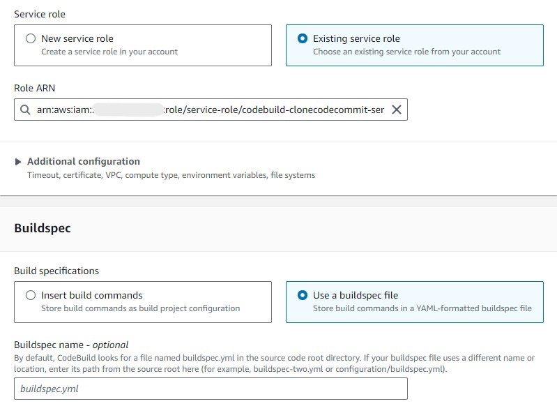
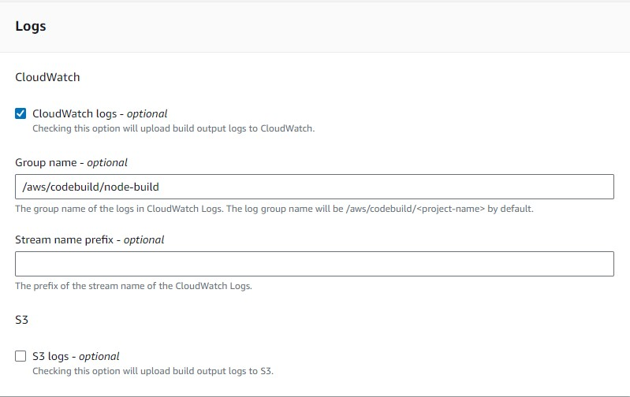
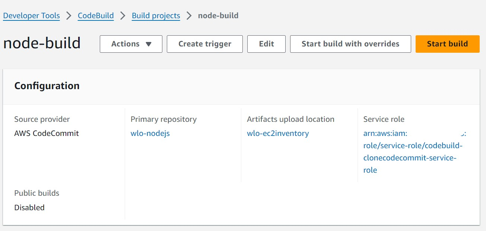

# CI/CD Workflow deploy to ECS using AWS Code Pipeline

<h2>Project Overview</h2>

In this project, we orchestrated the deployment of a robust cloud infrastructure on AWS using Terraform, focusing on VPC, subnetting, and ECS services. Leveraging Terraform's declarative syntax, we defined our infrastructure as code, ensuring consistency and repeatability across environments. By breaking down our architecture into VPCs and subnets, we achieved network isolation and optimized resource allocation. Additionally, deploying containerized applications with ECS streamlined our operational processes, allowing for efficient scaling and management of Docker containers. Integrating AWS CodePipeline into our workflow automated the CI/CD pipeline, enabling seamless code deployments and ensuring rapid iteration cycles. This cohesive approach to infrastructure provisioning and application deployment lays a solid foundation for scalable, reliable, and secure cloud-native solutions.

<h2>Code Build</h2>

 <b>Creating New Code Build Project</b> 
    <b>Project Name :</b> node-build  
    <b>Source :</b> Code Commit  
   <b>Repository :</b> Your Repo Name

    <b>Environment :</b> default  

    <b>Service Role :</b> Your Existing Service Role or Create one  
    <b>BuildSpec :</b> Use a buildspec file 

    <b>Artifacts :</b> S3  
    <b>Bucket Name :</b> Your S3 Bucket Name  
    <b>Service Role :</b> Bucket Directory 

    <b>Cloud Watch Logs : </b> 
    <b>Group Name</b> /aws/codebuild/node-build  

And then , Create build project

   <b>Now, you can see your build project and start build</b> 

