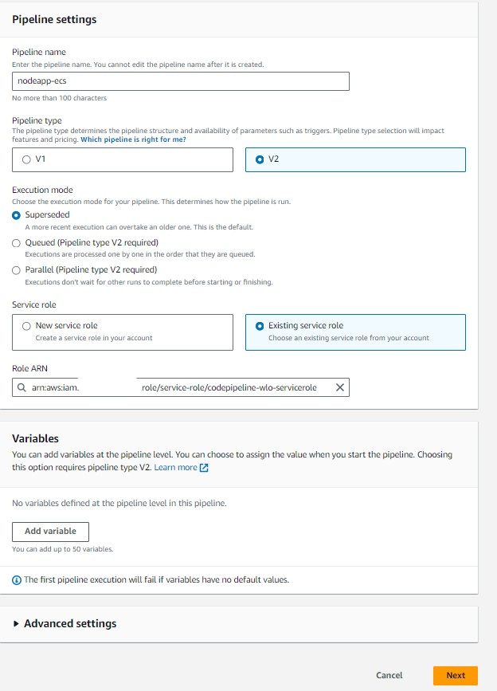
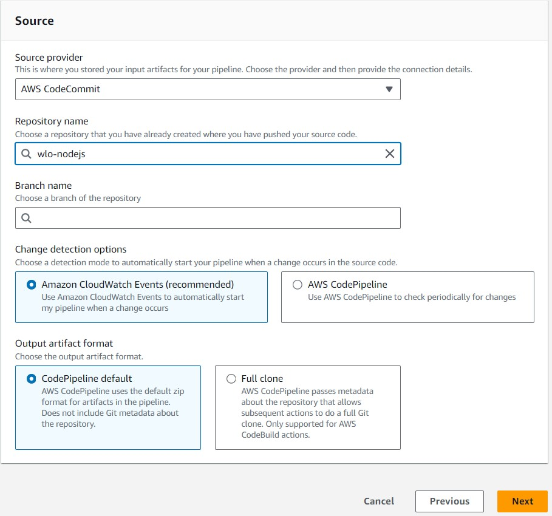
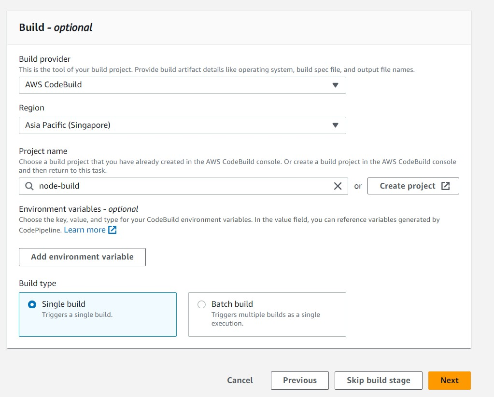
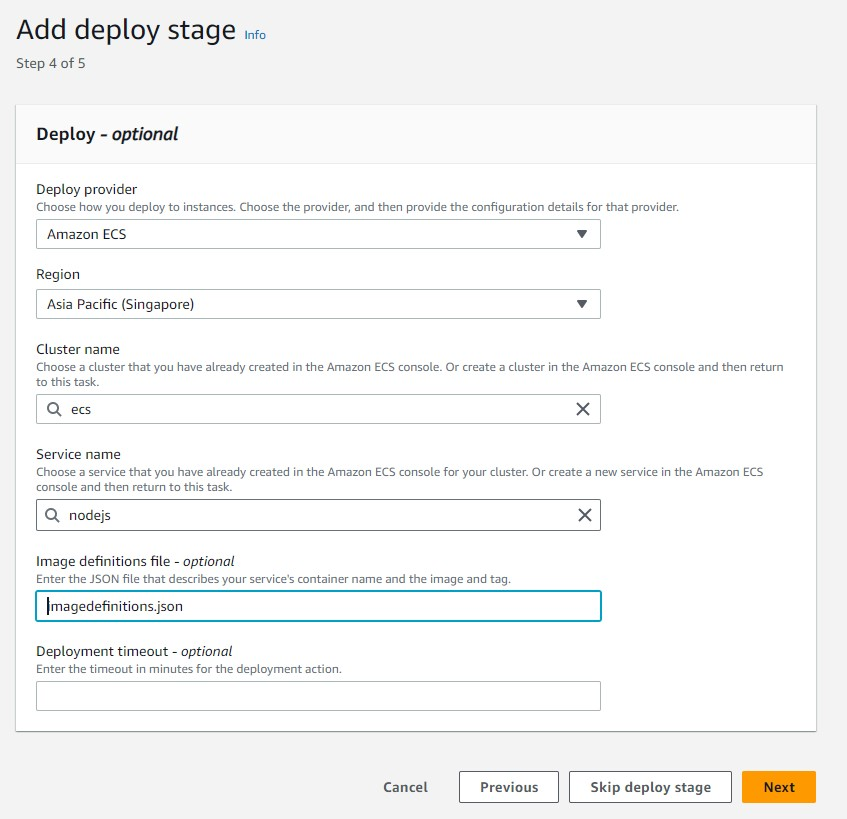
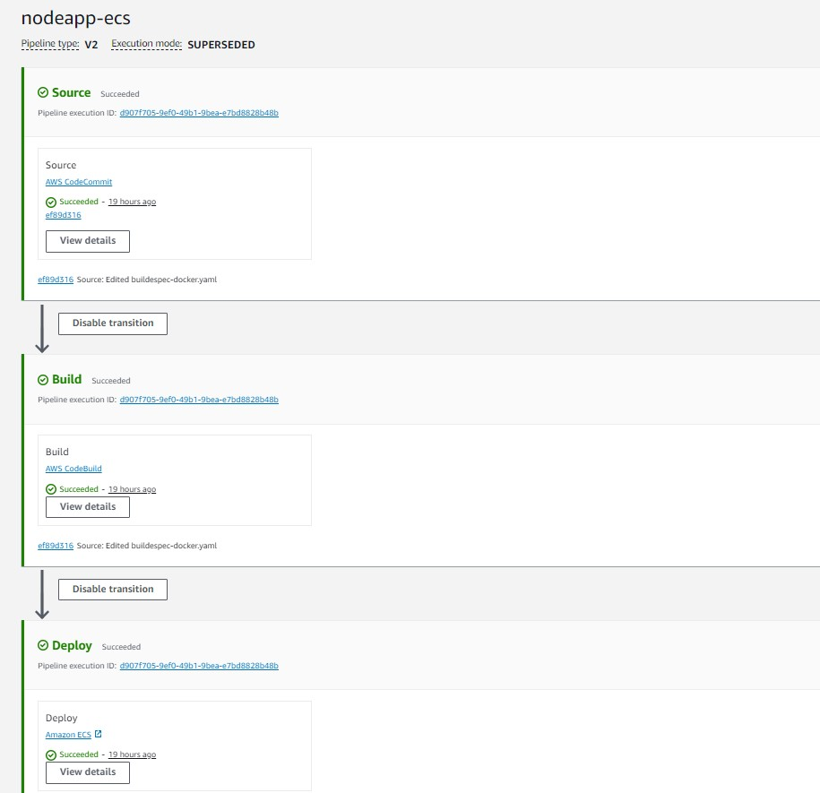

# CI/CD Workflow deploy to ECS using AWS CodePipeline

<h2>Project Overview</h2>

In this project, we orchestrated the deployment of a robust cloud infrastructure on AWS using Terraform, focusing on VPC, subnetting, and ECS services. By breaking down our architecture into VPCs and subnets, we achieved network isolation and optimized resource allocation. Additionally, deploying containerized applications with ECS streamlined our operational processes, allowing for efficient scaling and management of Docker containers. Integrating AWS CodePipeline into our workflow automated the CI/CD pipeline, enabling seamless code deployments and ensuring rapid iteration cycles.

<h2>Pre-requisites</h2>

<b>CodeCommit :</b> You need to create a repository in CodeCommit and Upload all files to repo.

<b>SSM Parameters Store :</b> You need to create two parameters in AWS System Manager Parameter Store to keep AWS account ID and Region Values.

<b>Image:</b> You need to upload a first image with tag to AWS ECR

<b>ECS:</b> You can check this github https://github.com/wailinoo1/Terraform-ECS-GitHubAction.git to build ECS Infrastructure with terraform as a refrence.

<h2>Code Build</h2>

 <b>Creating New Code Build Project</b> 
    <b>Project Name :</b> node-build  
    <b>Source :</b> Code Commit  
   <b>Repository :</b> Your Repo Name

    <b>Environment :</b> default  

    <b>Service Role :</b> Your Existing Service Role or Create one  
    <b>BuildSpec :</b> Use a buildspec file 

    <b>Artifacts :</b> S3  
    <b>Bucket Name :</b> Your S3 Bucket Name  
    <b>Service Role :</b> Bucket Directory 

    <b>Cloud Watch Logs : </b> 
    <b>Group Name</b> /aws/codebuild/node-build  

And then , Create build project

   <b>Now, you can see your build project and start build</b> 

<h2>CodePipeline</h2>

    <b>Creating CodePipeline :</b> 
    <b>Pipeline Name :</b> nodeapp-ecs  
    <b>Service Role :</b> Your Existing Service Role or new one  
   <b>And then , Next</b>

    <b>Source :</b> 
    <b>Source Provider :</b> CodeCommit  
    <b>Repository Name :</b> Your Existing Repo Name  
    <b>Branch Name :</b> master   
   <b>And then , Next</b>

    <b>Build :</b> 
    <b>Build Provider :</b> AWS CodeBuild  
    <b>Region :</b> AWS Region  
    <b>Project Name :</b> Build Project Name that we created previous step   
   <b>And then , Next</b>

    In Deploy Option , we will choose ECS as a deploy provider cause we want to deploy our build image to AWS ECS 
    <b>Deploy Provier :</b> ECS  
    <b>Region :</b> AWS Region  
    <b>Cluster Name :</b> Your ECS Cluser Name  
    <b>Service Name :</b> Your ECS Service Name   
    <b>Image Definitions File :</b> imagedefinition.json   
    <b>If you are deploying container-based applications, you must generate an image definitions file to provide the CodePipeline job worker with the Amazon ECS container and image identification to retrieve from the image repository, such as Amazon ECR.</b> 
   <b>And then , Next</b>

    <b>Now , you can see CodePipeline and it will start deploying to ECS when every commit changes happen in CodeCommit Repository</b> 

<h2>Conclusion</h2>

In conclusion, our project successfully implemented a robust cloud infrastructure on AWS using Terraform, focusing on VPC, subnetting, and ECS services. By leveraging infrastructure as code principles, we achieved consistency, repeatability, and scalability across environments. The integration of AWS CodePipeline automated our CI/CD pipeline, facilitating rapid and reliable application deployments. Overall, our approach ensures efficient resource utilization, streamlined operational processes, and sets the stage for future growth and innovation in cloud-native development.

